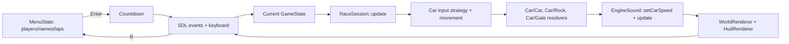

# miniCar

A tiny 2-player top-down racing game written in C++17 on top of SDL3. Six cars
drive around a stadium-shaped circuit with rocks, cyclically-opening gates and a
synthesized engine drone. Any AI car can be taken over as Player 1 (WASD) or
Player 2 (IJKL).

## Architecture

The game runs a classic `init → loop → shutdown` structure driven from
[src/main.cpp](src/main.cpp). Each frame the loop pumps SDL events, updates every
actor, resolves collisions, then renders the world and the HUD.

### Layers

- **App/platform** — [Setup](include/Setup.h) owns window, renderer, font and
  SDL/SDL3_ttf lifetime through `initApp` / `shutdownApp`.
- **Game/application** — [Game](include/game/Game.h) owns the SDL-facing
  resources, runs the loop, and delegates its countdown, racing, and finished
  modes to `GameState` implementations.
- **Race domain** — [RaceSession](include/game/RaceSession.h) owns one race's
  mutable simulation state (cars, rocks, gates, driver assignment, and winner)
  without creating a window or audio device.
- **World** — [Track](include/Track.h) is the stadium-shaped circuit. It exposes
  `sample(s)` to convert an arc-length parameter into a world-space
  position + heading; every mobile/static object is placed via `s` rather than
  raw `(x, y)`.
- **Actors** — Everything that lives in the world derives from
  [Actor](include/actor/Actor.h) and is drawn through a virtual `render()`.
- **Input** — Cars use interchangeable [input controllers](include/input/InputController.h):
  keyboard controls for human drivers and adaptive-cruise AI for unassigned cars.
- **Audio** — [EngineSound](include/Audio.h) synthesizes a per-car engine
  drone directly with `SDL_AudioDevice` (no `SDL_mixer` dependency). Each
  car's target speed is set every frame, but the stream is only fed once per
  frame via `EngineSound::update(dt)`, so playback stays in sync with real
  time instead of drifting.
- **Entry point** — [src/main.cpp](src/main.cpp) wires everything together, owns
  the game loop and renders the HUD: player labels show `"Player 1: <car
  name>"` / `"Player 2: <car name>"`, and each leaderboard row is tagged with
  its driver (`P1` / `P2` / `AI`) alongside the lap count.

### Classes

| Class | File | Role |
| --- | --- | --- |
| `Actor` | [include/actor/Actor.h](include/actor/Actor.h) | Base class with encapsulated `id`, `name`, `color`, `position` plus getters/setters, and a virtual `render()`. |
| `Track` | [include/Track.h](include/Track.h) | Stadium-shaped closed circuit; provides arc-length sampling and background rendering. |
| `Car` | [include/actor/Car.h](include/actor/Car.h) | `Actor`. Delegates driving to an input strategy; tracks laps and supplies collision helpers. |
| `Rock` | [include/actor/Rock.h](include/actor/Rock.h) | `Actor`. Static obstacle placed off the AI lanes; jagged polygon renderer plus car-collision resolver. |
| `Gate` | [include/actor/Gate.h](include/actor/Gate.h) | `Actor`. Barrier that cycles between open and closed; when closed it blocks cars. |
| `StartLine` | [include/actor/StartLine.h](include/actor/StartLine.h) | `Actor`. Checkered start/finish stripe positioned at an arc-length `s` on the track. |
| `EngineSound` | [include/Audio.h](include/Audio.h) | Synthesizes up to `kMaxCars` engine voices (sine/sawtooth blend with harmonics, idle wobble, and speed-slewed pitch) and queues exactly one chunk per frame via `update(dt)`. |
| `UiSound` | [include/Audio.h](include/Audio.h) | One-shot SDL beep tones (e.g. countdown fallback) queued via `SDL_QueueAudio`. |
| `Voice` | [include/Voice.h](include/Voice.h) | Optional spoken-word cue ("3", "2", "1", "Go") synthesized with espeak-ng, if found at build time; otherwise a silent no-op and the game falls back to `UiSound` beeps. |
| `HudRenderer` | [include/game/HudRenderer.h](include/game/HudRenderer.h) | Draws the player name tags and the per-car lap leaderboard, tagging each row with its driver (`P1` / `P2` / `AI`) so it's always clear who's driving which car. |
| `AppWindow` / `initApp` | [include/Setup.h](include/Setup.h) | Bundles window/renderer/font and centralizes SDL init and shutdown. |
| `Game` | [include/game/Game.h](include/game/Game.h) | Top-level owner of platform resources, renderers, audio, the current state, and the current `RaceSession`. |
| `RaceSession` | [include/game/RaceSession.h](include/game/RaceSession.h) | Headless race simulation: creates and updates the race world, applies collisions, driver assignment, and determines the winner. |
| `GameState` | [include/game/GameState.h](include/game/GameState.h) | State interface implemented by the setup menu, countdown, racing, and finished phases. |
| `MenuState` | [include/game/GamePhases.h](include/game/GamePhases.h) | Pre-race setup screen: player count (0-2), player names, laps to win. Shown at startup and on every `R` restart. |

### Frame flow



### Controls

#### Setup menu (shown at startup and every restart)

- **Up/Down** — select a field (players, player 1/2 name, laps to win).
- **Left/Right** — change the selected field's value (players: 0-2, laps: 1-20).
- **Type / Backspace** — edit the focused player name (up to 14 characters).
- **Enter** — start the race with the current selections.
- **Esc** — quit.

#### In-race

- **Player 1** — `W` / `A` / `S` / `D` to accelerate, steer left, brake, steer right.
- **Player 2** — `I` / `J` / `K` / `L` (joins/leaves at runtime via the assign helpers in `Car`).
- **Restart** — `R` returns to the setup menu (prefilled with the last selections).
- **Quit** — close the window or press `Esc`.

## Build

### Requirements

- A C++17 compiler (GCC, Clang or MSVC).
- CMake ≥ 3.16 and a build tool (Ninja or Make).
- SDL3 development headers/libraries.
- SDL3_ttf development headers/libraries.
- Catch2 v3 development package, when building the default unit-test suite.
- *(Optional)* `libespeak-ng` runtime library, for a spoken ("3", "2", "1", "Go")
  pre-race countdown instead of plain beep tones. `CMakeLists.txt` auto-detects
  it (including the bare versioned runtime `.so.1`, without needing the -dev
  package/headers); if it's not found the game still builds fine and just uses
  beeps.

Install on Debian/Ubuntu:

```bash
sudo apt install build-essential cmake ninja-build \
                 libsdl3-dev libsdl3-ttf-dev libsdl3-image-dev \
                 libcatch2-dev \
                 libespeak-ng1  # optional, for the spoken countdown
```

Install on Fedora:

```bash
sudo dnf install gcc-c++ cmake ninja-build SDL3-devel SDL3_ttf-devel
```

Install on macOS (Homebrew):

```bash
brew install cmake ninja sdl3 sdl3_ttf
```

On Windows the easiest path is [vcpkg](https://github.com/microsoft/vcpkg):

```powershell
vcpkg install sdl3 sdl3-ttf
```

and then point CMake at the vcpkg toolchain file.

### Configure & build

From the repository root:

```bash
cmake -S . -B build -G Ninja
cmake --build build
```

On Linux, use `buildLinux` as the out-of-tree build directory instead of the
generic `build` shown above — it's the convention this repo uses for local
Linux builds and is excluded from git via `.gitignore` (build artifacts should
never be committed):

```bash
cmake -S . -B buildLinux -G Ninja
cmake --build buildLinux
```

The build produces the `<builddir>/minicar` executable (or `build/minicar.exe`
on Windows) and the `<builddir>/tests/minicar_tests` unit-test binary. The
test suite is enabled by default. To build only the game, configure with:

```bash
cmake -S . -B buildLinux -G Ninja -DMINICAR_BUILD_TESTS=OFF
```

### Test

Run the headless gameplay unit tests with CTest:

```bash
ctest --test-dir buildLinux --output-on-failure
```

For strict local checks, enable warnings as errors and runtime sanitizers:

```bash
cmake -S . -B buildLinux -G Ninja \
  -DMINICAR_WARNINGS_AS_ERRORS=ON \
  -DMINICAR_ENABLE_SANITIZERS=ON
cmake --build buildLinux
ctest --test-dir buildLinux --output-on-failure
```

The tests link against the `minicar_core` static library, which contains track
math, collisions, actors, input strategies, and race-domain code. SDL window,
font, renderer, and audio-device code stays in the `minicar` executable, so
the test suite does not require a display or audio output device.

### Run

```bash
./buildLinux/minicar
```

The game window opens directly; a system font is loaded for the HUD, and audio
falls back gracefully to a silent run if no output device is available.
