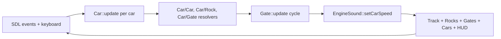

# miniCar

A tiny 2-player top-down racing game written in C++17 on top of SDL2. Ten cars
drive around a stadium-shaped circuit with rocks, cyclically-opening gates and a
synthesized engine drone. Any AI car can be taken over as Player 1 (WASD) or
Player 2 (IJKL).

## Architecture

The game runs a classic `init → loop → shutdown` structure driven from
[src/main.cpp](src/main.cpp). Each frame the loop pumps SDL events, updates every
actor, resolves collisions, then renders the world and the HUD.

### Layers

- **App/platform** — [Setup](include/Setup.h) owns window, renderer, font and
  SDL/SDL_ttf lifetime through `initApp` / `shutdownApp`.
- **World** — [Track](include/Track.h) is the stadium-shaped circuit. It exposes
  `sample(s)` to convert an arc-length parameter into a world-space
  position + heading; every mobile/static object is placed via `s` rather than
  raw `(x, y)`.
- **Actors** — Everything that lives in the world derives from
  [Actor](include/actor/Actor.h) and is drawn through a virtual `render()`.
- **Audio** — [EngineSound](include/Audio.h) synthesizes a per-car engine drone
  directly with `SDL_AudioDevice` (no `SDL_mixer` dependency).
- **Entry point** — [src/main.cpp](src/main.cpp) wires everything together, owns
  the game loop and renders the HUD (player labels, lap counters, win banner).

### Classes

| Class | File | Role |
| --- | --- | --- |
| `Actor` | [include/actor/Actor.h](include/actor/Actor.h) | Base class with encapsulated `id`, `name`, `color`, `position` plus getters/setters, and a virtual `render()`. |
| `Track` | [include/Track.h](include/Track.h) | Stadium-shaped closed circuit; provides arc-length sampling and background rendering. |
| `Car` | [include/actor/Car.h](include/actor/Car.h) | `Actor`. Handles player input, adaptive-cruise AI, lap tracking, collision helpers and grid setup. |
| `Rock` | [include/actor/Rock.h](include/actor/Rock.h) | `Actor`. Static obstacle placed off the AI lanes; jagged polygon renderer plus car-collision resolver. |
| `Gate` | [include/actor/Gate.h](include/actor/Gate.h) | `Actor`. Barrier that cycles between open and closed; when closed it blocks cars. |
| `StartLine` | [include/actor/StartLine.h](include/actor/StartLine.h) | `Actor`. Checkered start/finish stripe positioned at an arc-length `s` on the track. |
| `EngineSound` | [include/Audio.h](include/Audio.h) | SDL audio callback that mixes up to `kMaxCars` sawtooth engines with per-car pitch/volume. |
| `UiSound` | [include/Audio.h](include/Audio.h) | One-shot SDL beep tones (e.g. countdown fallback) queued via `SDL_QueueAudio`. |
| `Voice` | [include/Voice.h](include/Voice.h) | Optional spoken-word cue ("3", "2", "1", "Go") synthesized with espeak-ng, if found at build time; otherwise a silent no-op and the game falls back to `UiSound` beeps. |
| `AppWindow` / `initApp` | [include/Setup.h](include/Setup.h) | Bundles window/renderer/font and centralizes SDL init and shutdown. |

### Frame flow



### Controls

- **Player 1** — `W` / `A` / `S` / `D` to accelerate, steer left, brake, steer right.
- **Player 2** — `I` / `J` / `K` / `L` (joins/leaves at runtime via the assign helpers in `Car`).
- **Restart** — `R` resets the race (new car grid, rocks, gates and player assignment).
- **Quit** — close the window or press `Esc`.

## Build

### Requirements

- A C++17 compiler (GCC, Clang or MSVC).
- CMake ≥ 3.16 and a build tool (Ninja or Make).
- SDL2 development headers/libraries.
- SDL2_ttf development headers/libraries.
- *(Optional)* `libespeak-ng` runtime library, for a spoken ("3", "2", "1", "Go")
  pre-race countdown instead of plain beep tones. `CMakeLists.txt` auto-detects
  it (including the bare versioned runtime `.so.1`, without needing the -dev
  package/headers); if it's not found the game still builds fine and just uses
  beeps.

Install on Debian/Ubuntu:

```bash
sudo apt install build-essential cmake ninja-build \
                 libsdl2-dev libsdl2-ttf-dev \
                 libespeak-ng1  # optional, for the spoken countdown
```

Install on Fedora:

```bash
sudo dnf install gcc-c++ cmake ninja-build SDL2-devel SDL2_ttf-devel
```

Install on macOS (Homebrew):

```bash
brew install cmake ninja sdl2 sdl2_ttf
```

On Windows the easiest path is [vcpkg](https://github.com/microsoft/vcpkg):

```powershell
vcpkg install sdl2 sdl2-ttf
```

and then point CMake at the vcpkg toolchain file.

### Configure & build

From the repository root:

```bash
cmake -S . -B build -G Ninja
cmake --build build
```

The build produces the `build/minicar` executable (or `build/minicar.exe` on
Windows).

### Run

```bash
./build/minicar
```

The game window opens directly; a system font is loaded for the HUD, and audio
falls back gracefully to a silent run if no output device is available.
